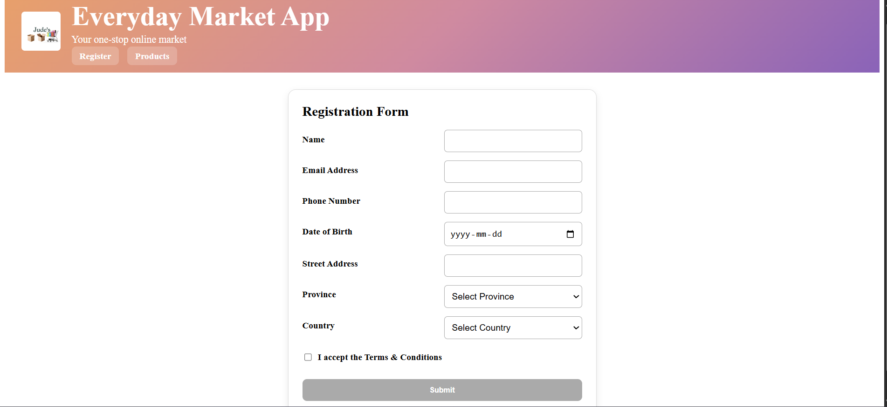
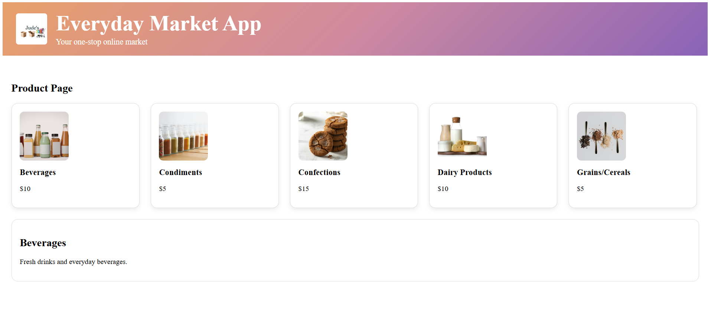

# Everyday Market App – Assignment #3 Update


A modern Angular application built using standalone components and Angular routing. This project was created for a school assignment and demonstrates component-based architecture, reactive forms, routing, form validation, event binding, and custom styling.

---

# Assignment #3 Update

This updated version of the project adds:

- Angular Routing
- Reactive Registration Form
- Form Validation
- Custom Validators
- Navigation between pages
- Submit and Redirect functionality

---

## Screenshots 

### Register Page



### Products Page




## Features

- Custom gradient header with logo
- Navigation buttons using Angular Router
- Product cards with images
- Clickable product selection
- Product description section
- Angular standalone components
- Reactive Registration Form
- Custom form validation
- Redirect to Products page after successful submit
- Responsive layout with CSS
- Dynamic product data rendering

---

## Registration Form Features

The registration form includes:

- Name validation
  - Letters and spaces only
  - Minimum 5 characters

- Email validation
  - Valid email format required

- Phone number validation
  - Must contain exactly 10 digits

- Date of Birth
  - Uses Angular date picker

- Street Address validation
  - Letters, numbers, and spaces only

- Province dropdown
  - Canadian provinces and territories

- Country dropdown
  - Canada and United States options
  - Canada must be selected to continue

- Terms & Conditions checkbox
  - Must be accepted before submit

- Submit button
  - Disabled until the form is fully valid

- Visual validation indicators
  - Invalid touched fields display red borders

---

## Technologies Used

- Angular 17+
- TypeScript
- HTML5
- CSS3
- Angular Router
- ReactiveFormsModule

---

## Project Structure

```text
everyday-market-app/
├── public/
│   └── assets/
│       └── images/
│           └── logo.png
├── screenshots/
│   ├── homepage.png
│   └── register-page.png
├── src/
│   └── app/
│       ├── shared/
│       │   └── header/
│       └── market/
│           ├── products-page/
│           ├── register-page/
│           ├── category-menu/
│           ├── category-menu-item/
│           └── model/
│               └── category.ts
└── README.md
````

---

## Routes

| Route       | Component                |
| ----------- | ------------------------ |
| `/register` | RegisterPage             |
| `/products` | ProductsPage             |
| `/`         | Redirects to `/register` |

---

## Getting Started

### Clone the Repository

```bash
git clone https://github.com/Frans-jude/Everyday-market-app.git
cd everyday-market-app
```

### Install Dependencies

```bash
npm install
```

### Run the Application

```bash
ng serve
```

Open your browser and go to:

```text
http://localhost:4200
```

---

## Testing

### Test Steps Performed

1. Ran the application using `ng serve`
2. Verified routing between `/register` and `/products`
3. Verified homepage redirects to `/register`
4. Tested form validation with invalid inputs
5. Verified red borders display on touched invalid fields
6. Confirmed Submit button remains disabled until form is valid
7. Verified Canada must be selected before submission
8. Verified successful navigation to Products page after submit
9. Confirmed product cards display correctly
10. Verified responsive layout and custom styling

### Commands Used

```bash
ng serve
ng test
ng lint
ng g c shared/header
ng g c market/products-page
ng g c market/register-page
```

---

## AI Assistance

I used OpenAI Codex and ChatGPT for assistance with debugging Angular routing, reactive forms, validation logic, standalone components, and custom styling. All code was reviewed, tested, and understood before submission.

---

## Author

**Frans Jude Del Castillo**

---

```
```

